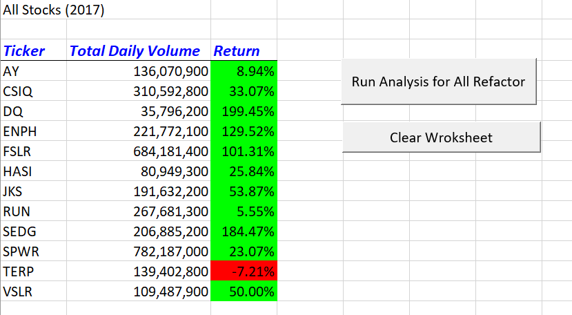
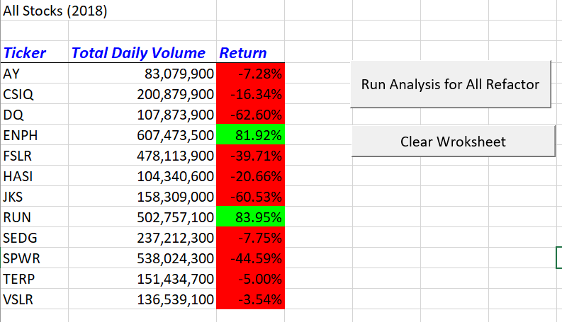

# stock-analysis
Stock Analysis Module 2
# Challenge
Module 2 challege for All Stock Analysis Refactored

# Code Analysis
* This is using Woksheets 2017 or 2028 for data analysis
* This code is using Array where we are storing all Ticker names
* Create Array volumes, startin and ending price and initizing to 0
* User is being asked for which worksheet to use and according to that for all Tickers, it is finding total volumes and returns 
* According to user input going through all rows in that worksheet and getting total volume for that index
* If previous row and current row ticker name is not same then get the value as starting price
* End price if current and next ticker are not same and in the array
* Add final data new worksheet
* Format new worksheet
* Create button for running the module and cleaing the sheet

# Analysis
According to final data looks like same tickers did well in 2017 than 2018. 2018 has more negative growth than 2017.

### 2017 Returns

### 2018 Returns

